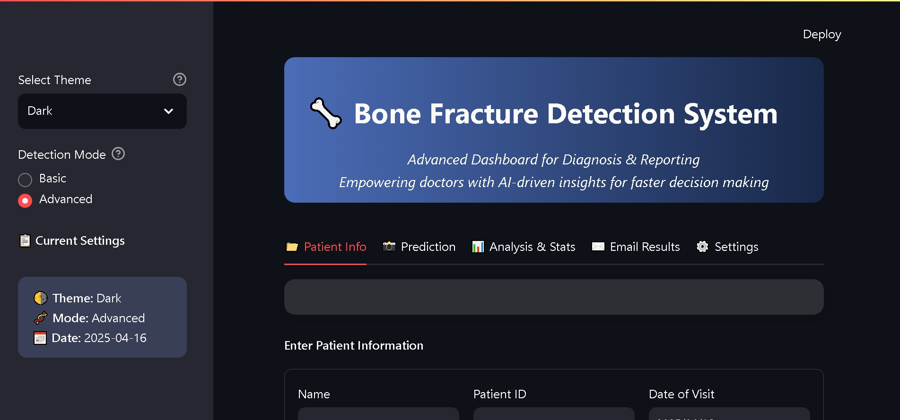
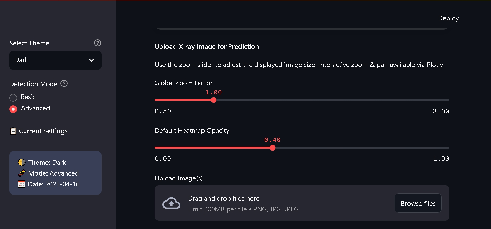
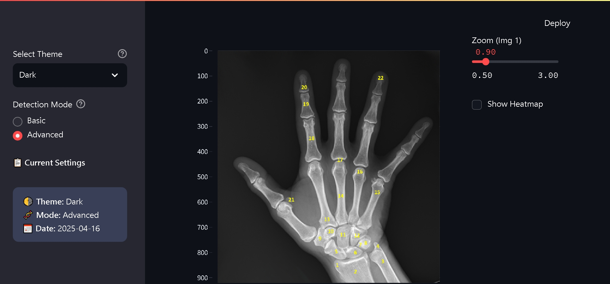
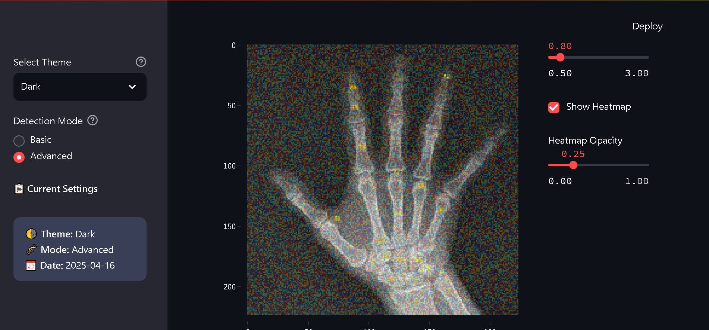
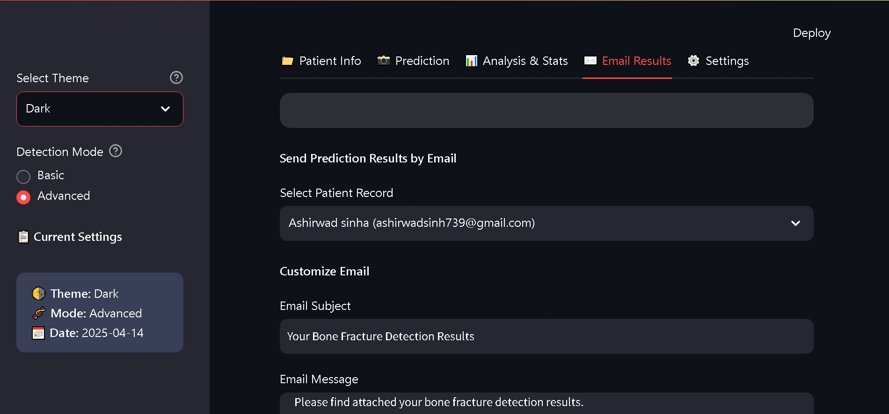
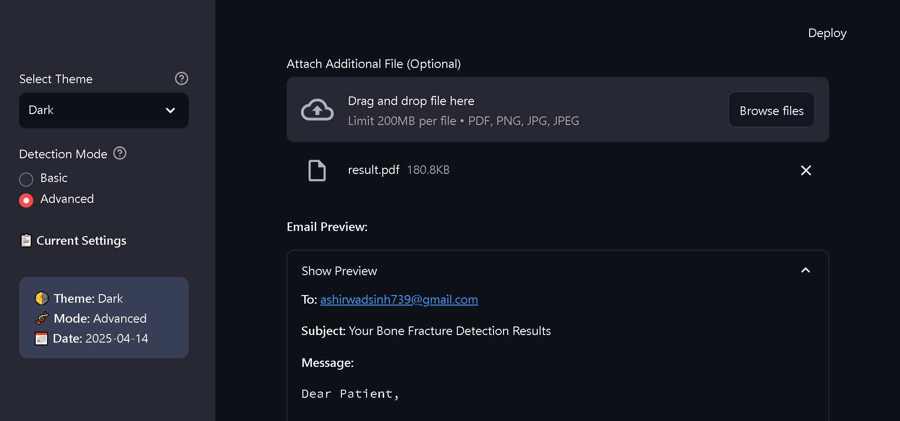
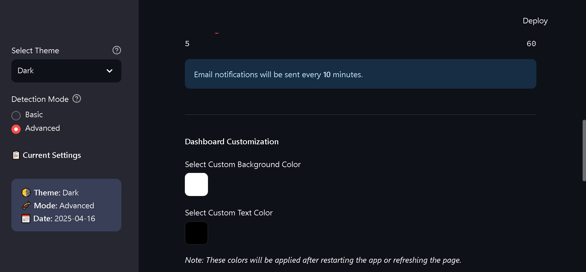

# Bone Fracture Detection Dashboard (UI Prototype)

This is a **UI prototype** for a Bone Fracture Detection Dashboard created using **Streamlit**. The focus of this prototype is on exploring an attractive dashboard layout, implementing a dark/light theme toggle, and ensuring responsive design. This project is purely for UI/UX design practice and does not include any functional machine learning integrations.

⚠️ **Note**: This is not a functional detection system but a **UI/UX prototype**.

## Features

- 🌗 **Theme Toggle**: Quickly switch between Light and Dark themes.
- 🧬 **Detection Mode Switch**: Toggle between Basic and Advanced detection modes.
- 🖼️ **Custom-Styled Header and Sidebar**: Enjoy a stylish, user-friendly interface with custom styling.
- 📋 **Placeholder for Patient Information**: Reserve space for patient details and other key information.

## Technologies Used

- **Streamlit**: For creating and deploying the dashboard interface.
- **HTML/CSS**: For custom embedded styles that enhance the UI design.
- **Shiny**: For creating and deploying the dashboard interface with R.

## Getting Started

Follow these steps to get the dashboard running on your local machine:

### Prerequisites

For Python Make sure you have Python installed. Download Python from [python.org](https://www.python.org/downloads/) if necessary.

For R Make sure you have **R** and **RStudio** installed.

- 📦 [Download R](https://www.r-project.org/)
- 🧰 [Download RStudio](https://www.rstudio.com/)
- 📦 [Install Shiny](https://rstudio.cloud/docs/shiny/)

---

### Installation

1. **Clone the Repository**

   Clone this repository to your local machine using the following command:

   ```bash
   git clone https://github.com/ashir1S/Bone-Fracture-Detection-Dashboard-UI.git
   cd Bone-Fracture-Detection-Dashboard-UI
   ```
2. **Prerequisites**

### a. **Install the required dependencies**

```bash
pip install -r requirements.txt
```
b.  **Run the app**
1>**For Streamlit app**

    ```r
    streamlit run dashboard.py  
            
2> **For Shiny app (R)**

    ```r
    shiny::runApp("app.R") 

    ```r
    shiny::runApp("D:/AI/AI Bone Fracture Detection System Dashboard", launch.browser=TRUE)

## Contributing

Feel free to fork the repository, make changes, and submit a pull request. Any suggestions or improvements are welcome!

## 📸 Dashboard Previews

Here are some previews of the dashboard interface:

### Patient Information Placeholder


### Prediction Feature


### Uploaded X ray Image Feature


### Heatmap Feature


### Email Results


### Email Preview


### Custom Setting Features


